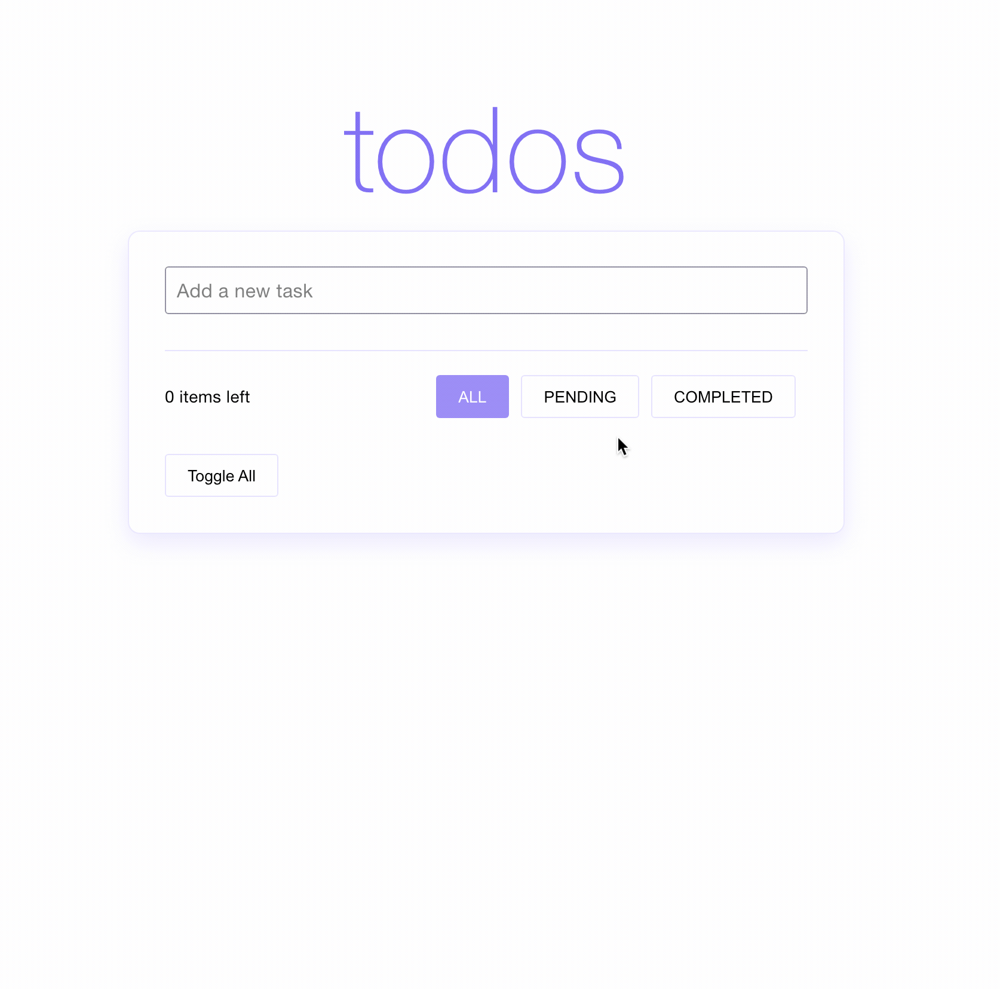

# Nested To Do List



## Demo
You can find a demo [here](https://juanchaur.github.io/todolist-nested/)


## Build Setup

In the project directory, you can run:

```bash
# install dependencies
npm i


# Runs the app in the development mode.
# Open [http://localhost:3000](http://localhost:3000) to view it in the browser.
npm run start

# Builds the app for production to the `build` folder.
npm run build

# Launches the test runner in the interactive watch mode.
npm run test

```

## TODO
- [ ] Add draggable instead of nested buttons
